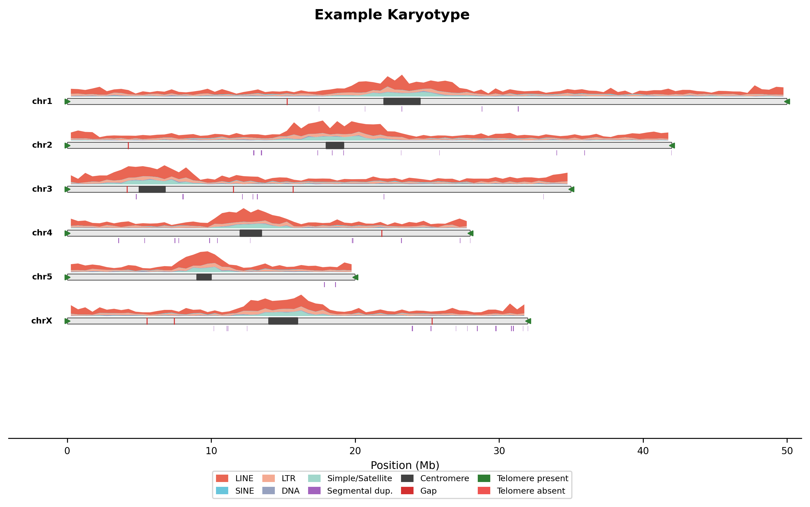

# genome-karyotype

Publication-quality linear karyotype ideogram with stacked repeat density tracks.



## Install

```bash
# with pixi (recommended)
pixi install

# or plain pip
pip install numpy matplotlib
```

## Run

Only `--chrom-sizes` is required. Everything else is optional — add tracks as you have them:

```bash
# minimal: just chromosome bars
python plot_linear_karyotype.py \
  --chrom-sizes genome.fa.fai \
  -o my_genome -t "My Species"

# full: all tracks
python plot_linear_karyotype.py \
  --chrom-sizes genome.fa.fai \
  --centromere centromeres.bed \
  --gaps gaps.bed \
  --repeatmasker genome.out \
  --segdups segdups.bedpe \
  --tidk tidk_search.tsv \
  --prefix chr \
  -o my_genome -t "My Species"
```

Outputs `my_genome_karyotype.png` (300 DPI) and `.pdf`.

## Try the example

```bash
pixi run example
```

This generates synthetic test data for a 6-chromosome genome and plots it.

## Inputs

| Flag | Format | Description |
|------|--------|-------------|
| `--chrom-sizes` | `.fai` or 2-col TSV | Chromosome sizes (required). `cut -f1,2 genome.fa.fai` works. |
| `--centromere` | BED | Centromere regions |
| `--gaps` | BED | Assembly gaps |
| `--repeatmasker` | `.out` | [RepeatMasker](https://www.repeatmasker.org/) output |
| `--segdups` | BED or BEDPE | Segmental duplications. BEDPE auto-detected; filters >90% identity using divergence in col 8 (BISER/SEDEF format). |
| `--tidk` | TSV | [tidk](https://github.com/tolkit/tidk) search output |

All BED inputs skip `#` comment lines.

## Options

| Flag | Description |
|------|-------------|
| `--prefix` | Only include chromosomes starting with this (e.g. `chr`, `SUPER_`) |
| `--min-size N` | Only include chromosomes >= N bp |
| `-w, --window N` | Density window size in bp (default: 500000) |
| `-t, --title` | Figure title |
| `-o, --output` | Output file prefix |

## Tracks

Each chromosome shows:
- **Repeat density** (stacked area) — LINE, SINE, LTR, DNA, Simple/Satellite
- **Chromosome bar** — centromere fill, gap lines, telomere markers at tips
- **Segmental duplications** — below the bar

## Citation

If you use this tool in your work, please cite:

> Abuelanin M, Kaya G, Lake JA, Lambert C, Wu MV, Berendzen K, Krasheninnikova K, Wood JMD, Solomon NG, Donaldson ZR, Bales KL, Howe K, Korlach J, Manoli DS, Tollkuhn J, Dennis MY. Single-library chromosome-scale diploid assemblies of vole genomes resolve a species-specific duplication implicated in pair bonding. *bioRxiv* 2026. doi: [10.64898/2026.03.13.711624](https://doi.org/10.64898/2026.03.13.711624)
